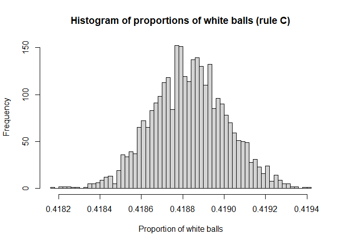

**Urn problems in probability**
================
Raul Almuzara

 

## Introduction

An *urn problem* is an exercise that involves questions about
probability properties when extracting balls of various colors from one
or more urns. For example, we may ask questions about the probability of
certain sequences of extractions or about the inference of the
proportion of balls of each color. We could also consider many different
experimental settings (replacement vs. non-replacement after each draw,
number of urns, number of ball colors, etc.).

Here, we will focus on the analysis via simulation of the convergence
properties of the proportion of balls of one color under different
rules. We will consider a single urn where we initially place a number
$a$ of white balls and a number $b$ of black balls. Each time, we draw
one ball and return it to the urn. However, depending on the type of
ball drawn, we will add new balls to the urn according to some rule.
After a large number of extractions and simulations, we will see where
the proportion of white balls converges.

4 rules will be considered separately. We draw a ball, return it to the
urn and then, we apply one of the following rules:

**Rule A:** If a white ball was drawn, a black ball is added to the urn.
If a black ball was drawn, a white ball is added to the urn.

**Rule B:** The same total number of balls (6) is always added after
each draw regardless of the color obtained. If a white ball was drawn,
four white balls and two black balls are added. If a black ball was
drawn, five white balls and one black ball are added.

**Rule C:** A different amount of balls is added to the urn after each
extraction depending on the color obtained. If a white ball was drawn,
two white balls and three black balls are added (5 in total). If a black
ball was drawn, three white balls and four black balls are added (7 in
total).

**Rule D:** (Pólya’s urn) If a white ball was drawn, an extra white ball
is added to the urn. If a black ball was drawn, an extra black ball is
added to the urn.

------------------------------------------------------------------------

In the following sections, we set an unequal number of initial white
balls (3) and initial black balls (7). In each section, we run 3000
simulations. In each simulation, we draw 5000 balls.

------------------------------------------------------------------------

## Rule A

``` r
set.seed(42)

#number of draws in each simulation
n <- 5000
#number of simulations
simulations <- 3000

proportion_white_A <- c()

for(j in 1:simulations)
{
  #initial number of white balls
  a <- 3
  #initial number of black balls
  b <- 7
  
  for(k in 1:n)
  {
    #Rule A
    {
    if(sample(c("white","black"), 1, prob=c(a/(a+b),b/(a+b)), replace=TRUE)=="white")
    {
      b <- b+1
    }
    else
    {
      a <- a+1
    }
    }
  }
  proportion_white_A <- c(proportion_white_A, a/(a+b))
}
```

We observe the distribution of the 3000 proportions of white balls
obtained.

``` r
hist(proportion_white_A,
     breaks = 50,
     main="Histogram of proportions of white balls (rule A)",
     xlab="Proportion of white balls",
     ylab="Frequency")
```

<!-- -->

Except for some extreme cases in which the proportion of white balls is
a few hundredths away, the convergence to 0.5 is clear. Even choosing
different initial numbers of black and white balls, in the end one tends
to have the same number of both.

------------------------------------------------------------------------

## Rule B

``` r
set.seed(42)

#number of draws in each simulation
n <- 5000
#number of simulations
simulations <- 3000

proportion_white_B <- c()

for(j in 1:simulations)
{
  #initial number of white balls
  a <- 3
  #initial number of black balls
  b <- 7

  for(k in 1:n)
  {
    #Rule B
    {
    if(sample(c("white","black"), 1, prob=c(a/(a+b),b/(a+b)), replace=TRUE)=="white")
    {
      a <- a+4
      b <- b+2
    }
    else
    {
      a <- a+5
      b <- b+1
    }
    }
  }
  proportion_white_B <- c(proportion_white_B, a/(a+b))
}
```

We observe the distribution of the 3000 proportions of white balls
obtained.

``` r
hist(proportion_white_B,
     breaks = 50,
     main="Histogram of proportions of white balls (rule B)",
     xlab="Proportion of white balls",
     ylab="Frequency")
```

<!-- -->

In this case, the proportion of white balls converges to
$\frac{5}{2+5}=\frac{5}{7}$ and the proportion of black balls converges
to $\frac{2}{2+5}=\frac{2}{7}$.

------------------------------------------------------------------------

## Rule C

``` r
set.seed(42)

#number of draws in each simulation
n <- 5000
#number of simulations
simulations <- 3000

proportion_white_C <- c()

for(j in 1:simulations)
{
  #initial number of white balls
  a <- 3
  #initial number of black balls
  b <- 7
  
  for(k in 1:n)
  {
    #Rule C
    {
    if(sample(c("white","black"), 1, prob=c(a/(a+b),b/(a+b)), replace=TRUE)=="white")
    {
      a <- a+2
      b <- b+3
    }
    else
    {
      a <- a+3
      b <- b+4
    }
    }
  }
  proportion_white_C <- c(proportion_white_C, a/(a+b))
}
```

We observe the distribution of the 3000 proportions of white balls
obtained.

``` r
hist(proportion_white_C,
     breaks = 50,
     main="Histogram of proportions of white balls (rule C)",
     xlab="Proportion of white balls",
     ylab="Frequency")
```

<!-- -->

Note that now we have not introduced the same number of balls in all
extractions because 2+3 does not equal 3+4. There seems to be
convergence to the particular proportion where the histogram peaks.

------------------------------------------------------------------------

## Rule D (Pólya’s urn)

``` r
set.seed(42)

#number of draws in each simulation
n <- 5000
#number of simulations
simulations <- 3000

proportion_white_D <- c()

for(j in 1:simulations)
{
  #initial number of white balls
  a <- 3
  #initial number of black balls
  b <- 7
  
  for(k in 1:n)
  {
    #Rule D
    {
    if(sample(c("white","black"), 1, prob=c(a/(a+b),b/(a+b)), replace=TRUE)=="white")
    {
      a <- a+1
    }
    else
    {
      b <- b+1
    }
    }
  }
  proportion_white_D <- c(proportion_white_D, a/(a+b))
}
```

We observe the distribution of the 3000 proportions of white balls
obtained.

``` r
hist(proportion_white_D,
     breaks = 50,
     main="Histogram of proportions of white balls (rule D)",
     xlab="Proportion of white balls",
     ylab="Frequency")
```

<!-- -->

In the previous sections, the proportions of white balls of each
simulation were distributed around a particular value in a very small
range. Now, for the Pólya’s urn, the histograms do not show a
convergence to a particular value. On the contrary, the proportions are
distributed over the interval $[0,1]$. In fact, it can be shown that the
proportions asymptotically follow a
$Beta\left(\frac{a}{m},\frac{b}{m}\right)$ distribution, where $a$ is
the initial number of white balls, $b$ is the initial number of black
balls, and $m$ is the number of additional balls of the same color that
we introduce after each draw. In this case, $a=3$, $b=7$, $m=1$.

Let’s verify the convergence to the $Beta(3,7)$ distribution.

``` r
interval <- seq(0,1,length=1000)
density_proportion_white <- density(proportion_white_D)
exact_density_beta <- dbeta(interval, 3, 7)
plot(density_proportion_white,
     col="red",
     main="Comparison of estimated and exact Beta(3,7) density",
     xlab="x",
     xlim=c(0,1))
lines(interval, exact_density_beta, col="blue")
legend("topright", legend=c("Estimated","Exact"), col=c("red","blue"), lty=c(1,1))
```

<!-- -->

In red, a density plot of the proportions of white balls obtained in the
3000 simulations.

In blue, the exact probability density function of a $Beta(3,7)$
distribution.

Undoubtedly, the estimation of the density of the proportions of white
balls is very similar to the exact PDF of the $Beta(3,7)$ distribution.
